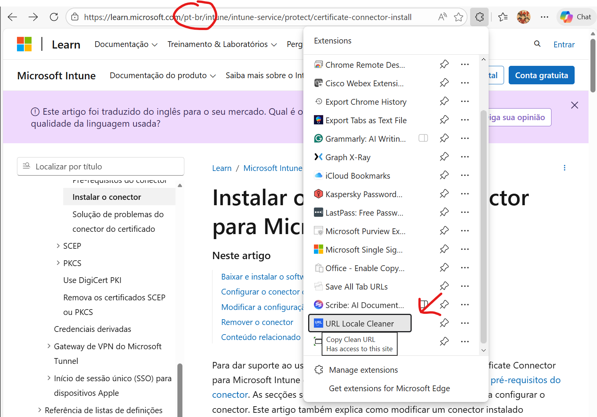

# URL Locale Cleaner Extension

A lightweight Manifest V3 browser extension that watches for copy or cut events inside webpages and automatically removes common language or marketing segments from URLs before they reach your clipboard. When you highlight a link such as `https://learn.microsoft.com/intune/intune-service/protect/certificate-connector-install` and press **Ctrl+C**, the extension rewrites it to `https://learn.microsoft.com/intune/intune-service/protect/certificate-connector-install` so the server can redirect recipients to their preferred locale.

## Features

- Strips leading locale path segments (for example `en-us`, `pt-br`, `zh-hant`) on popular documentation domains such as `learn.microsoft.com` and `developer.mozilla.org`.
- Removes noisy marketing query parameters (e.g., `WT.mc_id`, `ocid`, `gclid`, `msclkid`) so shared links stay clean and privacy-friendly.
- Runs entirely on the client: no network calls, analytics, or storage.
- Works anywhere inside a webpage (static text, editable fields, rich text editors) without requiring any UI.
- Adds a toolbar popup that shows the original vs. cleaned URL with quick-copy buttons for each.
- Keeps the page context-menu entry labeled **Copy Clean URL** for one-click copying and flashes a badge confirmation so you know it hit the clipboard.

> **Limitations**
>
> - Browser extensions cannot intercept copies that originate from the address bar, context-menu "Copy link address", or other browser chrome. The extension only sees copy/cut events that happen inside the document itself.

## Installation

1. Clone or download this repository.
2. Open your browser's extension page and enable **Developer mode**.
3. Choose **Load unpacked** (Chrome / Edge) or **Load Temporary Add-on** (Firefox) and select the `extension` folder in this repo.
4. Reload any open tabs that should use the cleaner.

## Using the Toolbar Action

1. Navigate to any supported documentation page (for example, a localized Microsoft Learn article).
2. Click the extension's toolbar icon to instantly copy the cleaned URL with a badge confirmation.
3. Right-click the page and choose **Copy Clean URL** for the same one-click behavior.
4. The badge shows **CLEAN** if the URL was modified, or **OK** if it was already clean.

### Screenshots

**Toolbar action in progress:**


**Toolbar icon with badge confirmation:**


**Edge browser integration:**


## Customizing Domains or Parameters

- The domain allowlist, locale pattern, and query-parameter blocklist live in `extension/url-cleaner.js`.
- Add or remove entries to tailor the cleaner to your own documentation sources.
- After editing the file, reload the extension from the browser's extension page to apply the changes.

## Publishing to Chrome Web Store & Edge Add-ons

### Prerequisites

Before submitting to either store, prepare the following:

1. **Create Extension Icons**
   - Design or generate icons in these sizes: `16x16`, `32x32`, `48x48`, `128x128` PNG files.
   - Save them to `extension/icons/` as `icon-16.png`, `icon-32.png`, `icon-48.png`, `icon-128.png`.
   - Update `manifest.json` with the icons field:
     ```json
     "icons": {
       "16": "icons/icon-16.png",
       "32": "icons/icon-32.png",
       "48": "icons/icon-48.png",
       "128": "icons/icon-128.png"
     }
     ```

2. **Write a Privacy Policy**
   - Host a simple privacy policy on your website or GitHub Pages stating: _"This extension processes URLs locally without collecting, storing, or transmitting any personal data."_
   - Both stores require a privacy policy URL.

3. **Prepare Store Assets**
   - A 1280×800px promotional banner (screenshot of the extension in action).
   - A 128×128px icon (same as your extension icon).
   - Store listing description (200–500 chars) highlighting the key benefits.

4. **Developer Accounts**
   - Chrome Web Store: Google account required for the $5 one-time registration fee.
   - Edge Add-ons: Microsoft account required (free).

### Publishing to Chrome Web Store

1. **Package the extension**

   ```bash
   # Zip the extension folder
   # Windows: right-click extension → Send to → Compressed (zipped) folder
   # Or use command:
   Compress-Archive -Path .\extension -DestinationPath urlclilangcleaner.zip
   ```

2. **Create a Chrome Web Store developer account**
   - Visit [chrome.google.com/webstore/devconsole](https://chrome.google.com/webstore/devconsole).
   - Sign in with your Google account and pay the $5 registration fee.

3. **Upload and submit**
   - Click **New Item** → select your `urlclilangcleaner.zip` file.
   - Fill in the store listing:
     - **Name**: URL Locale Cleaner
     - **Description**: Copy clean URLs without locale segments or tracking parameters.
     - **Category**: Developer Tools
     - **Language**: English
     - **Privacy policy URL**: your privacy policy URL
     - **Screenshots & banner**: upload promotional images.
   - Click **Publish** and wait for automatic review (usually 1–3 hours).

### Publishing to Microsoft Edge Add-ons

1. **Create a Microsoft Partner Center account**
   - Visit [partner.microsoft.com](https://partner.microsoft.com).
   - Sign in with your Microsoft account (free).

2. **Create a new submission**
   - Go to **Edge Add-ons Dashboard** → **New add-on**.
   - Upload your `urlclilangcleaner.zip` file.

3. **Fill in store details**
   - **Name**: URL Locale Cleaner
   - **Description**: Remove locale and marketing segments from documentation URLs.
   - **Category**: Productivity
   - **Privacy policy URL**: your privacy policy URL
   - **Store listing**: upload screenshots and banner (same as Chrome).

4. **Submit for review**
   - Click **Publish** and wait for review (usually 24–48 hours).
   - Edge reviews are generally stricter, so ensure your privacy policy and description are clear.

### Post-Submission

- Monitor both store listings for user reviews and feedback.
- Update your version number in `manifest.json` and resubmit whenever you publish updates.
- Respond professionally to user comments and reports.
- Consider adding release notes to your GitHub repo for transparency.

## Development Tips

- All logic currently resides in the content script so you can iterate quickly without bundlers.
- If you need background logic (e.g., options page), extend the manifest and keep scripts in the `extension` directory.
- Test your extension thoroughly on different documentation sites before submitting to stores.
- Use the Chrome DevTools and Edge DevTools to debug and monitor console logs during development.

---

## Author

**Thiago Beier**  
Email: [thiago.beier@gmail.com](mailto:thiago.beier@gmail.com)

Feel free to open issues, submit pull requests, or reach out with feedback and feature requests.
